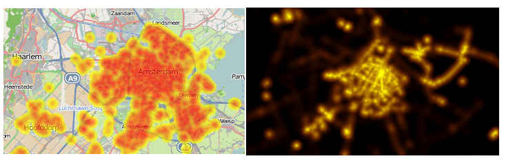

# MapGlow
MapGlow enables displaying your geodata as heatmaps using standard WMS requests. 
See demo and docs at http://mapglow.opentraces.org/ .

MapGlow is a Python MapScript addition to UMN MapServer. 

How it works: WMS `GetMap` and `GetLegendGraphic` requests are intercepted (using Python MapScript) for heatmap generation
from MapServer Layer Vector (Point-type) sources. 
Triggered when the STYLE(S) parameter starts with the magic word "heat". 

In that case the MapGlow Python script will query MapServer Layer Feature data
and draw a transparent overlay heatmap. The STYLES parameter also determines
the parameterization of how the heatmap should be drawn in terms of gradient colors and other parameters. 
See two extreme examples below:

MapGlow will delegate processing to the standard MapServer OWS dispatching
for other requests like `GetCapabilities` or when no STYLE(S) parameter is provided.

So the beauty of MapGlow is not just generating a heatmap, but to also function within (the confines of) 
the OGC WMS standard! Hence any (WMS) client can fetch heatmaps (plus control their parameterization). 

Note of warning: heatmap generation is a CPU-intense algorithmic process. 
In production deployment therefore it is advised to use a tiling server in front like MapProxy with
a MapServer-MapGlow enabled backend-WMS. 

The first versions of MapGlow were developed around 2013. Starting June 2020 development is revived.
